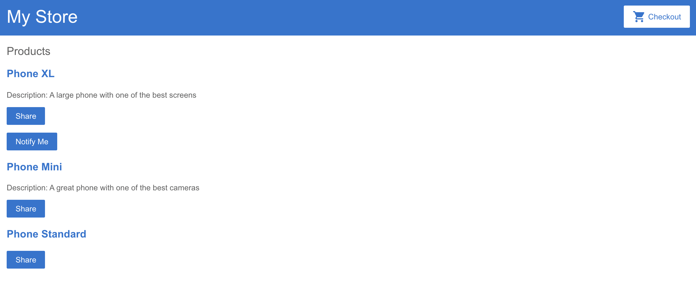
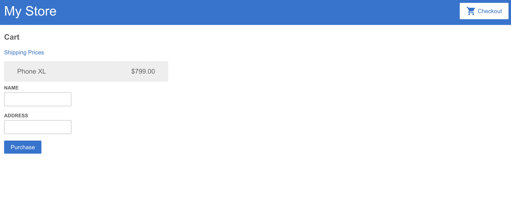

# Angular Shopping App

This project was generated with [Angular CLI](https://github.com/angular/angular-cli) version 12.1.1.

## Description

Product of following Angular documentation tutorial for first time Angular programmers.

## Table of Contents

* [Reference](#reference)
* [Details](#details)
* [Technologies](#technologies)
* [Installation](#installation)
* [Usage](#usage)
  
## Reference

Screenshot of application
  

Check Out
  
  

## Details
 Users can browse the store, view details, be notified of price drops, share items, add items to cart, view shipping costs, and input information to order product.
 
  
## Technologies
Built with Angular including Angular Routing, Angular Forms, Angular HttpClient, and Angular Component.

## Installation

To install all necessary materials for this project, run the following command:

```
npm install
```

## Usage

This is the product of a tutorial provided by Angular. While all code was hand-typed, the prompting and layout came from the Angular Documentation. Complete the tutorial yourself at https://angular.io/start.
